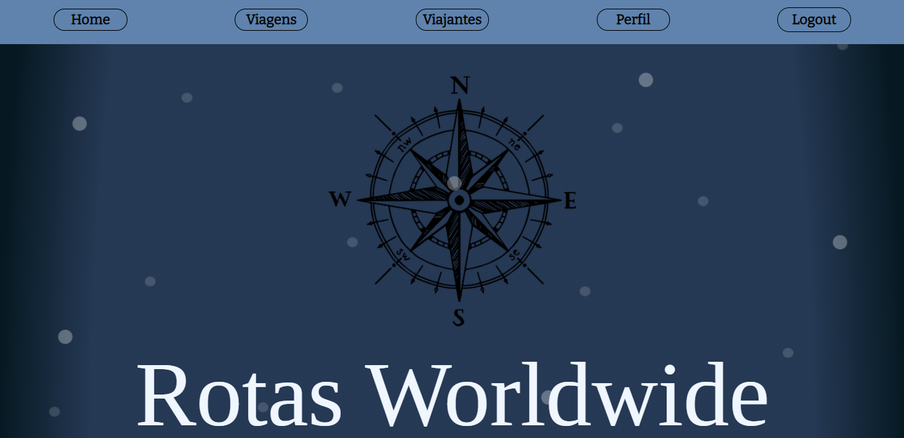
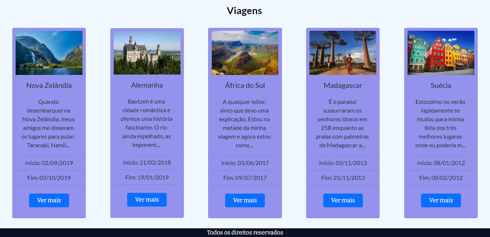
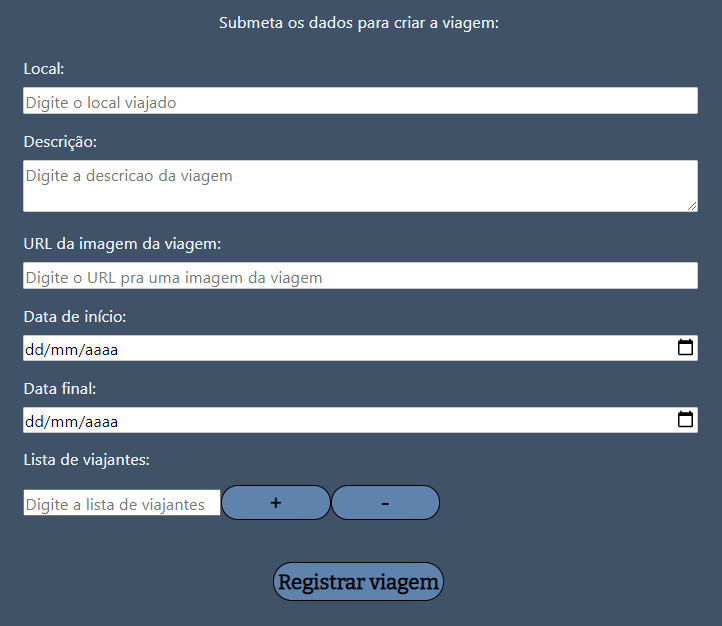

# Rotas Worldwide (Modo de Desenvolvimento)
## Rede social para viajantes desenvolvida com [React](https://pt-br.reactjs.org/) para o front-end e [Node.js](https://nodejs.org/en/)/[Express](https://expressjs.com/pt-br/) para o back-end.

#

#

